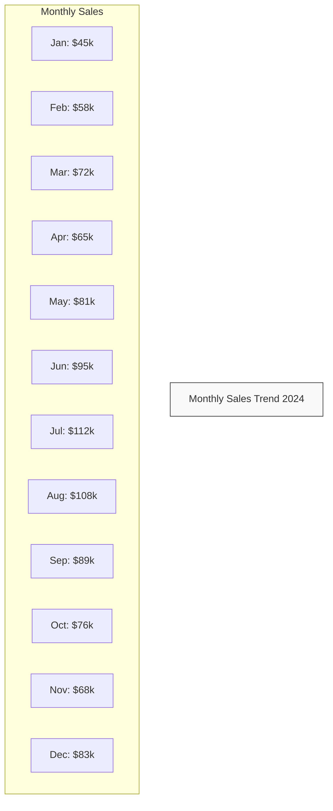
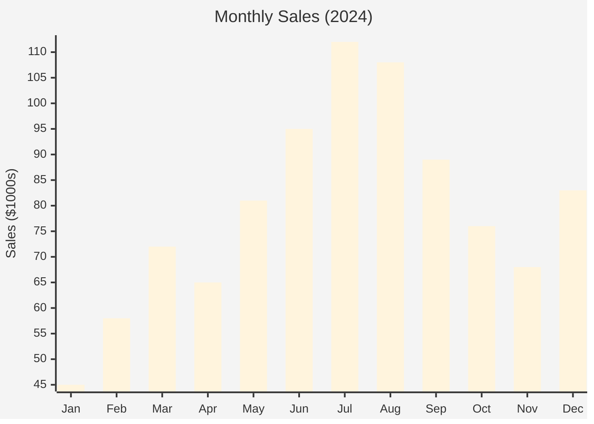
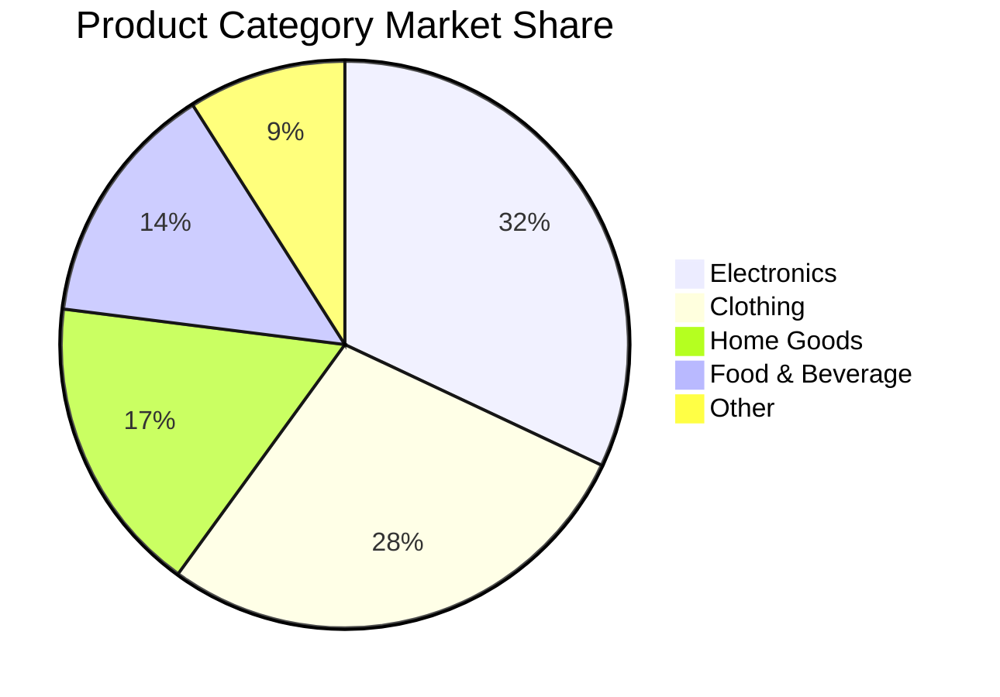
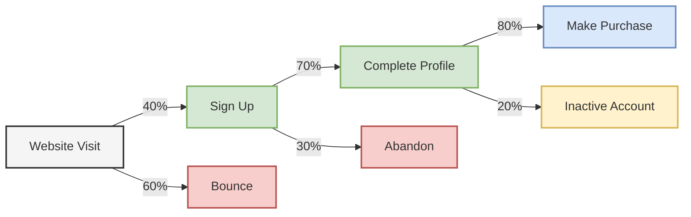
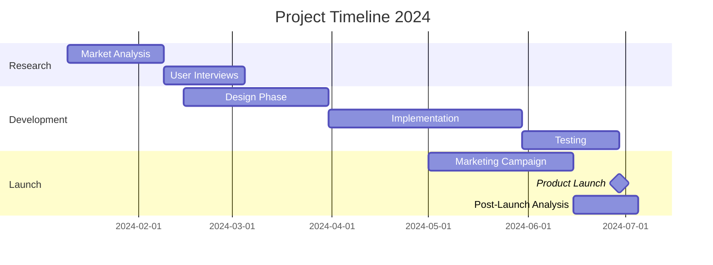
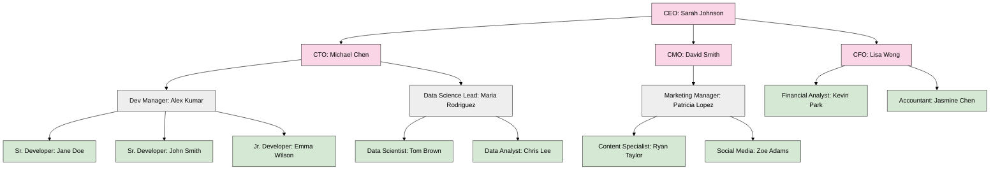
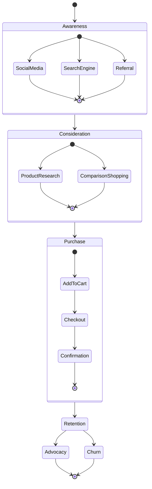
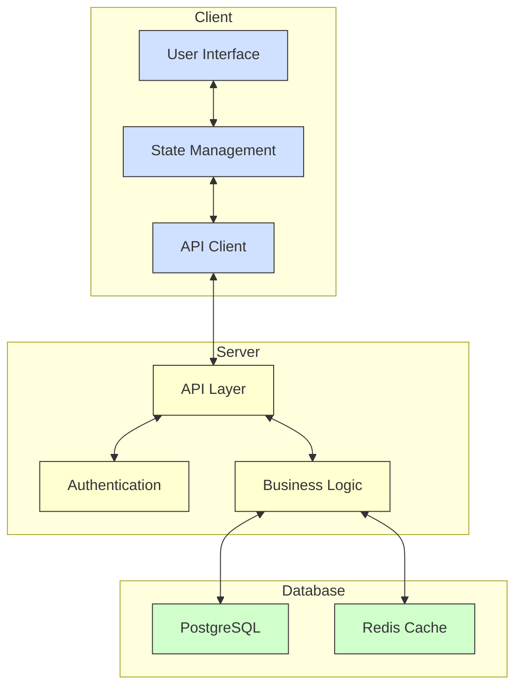
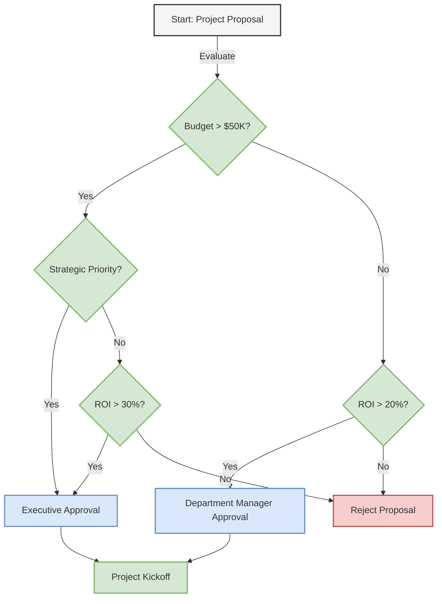

# uml# Random Data Visualization with Mermaid

## 1. Monthly Sales Data (2024)

| Month      | Sales (in $1000s) |
|------------|-------------------|
| January    | 45                |
| February   | 58                |
| March      | 72                |
| April      | 65                |
| May        | 81                |
| June       | 95                |
| July       | 112               |
| August     | 108               |
| September  | 89                |
| October    | 76                |
| November   | 68                |
| December   | 83                |

### Sales Trend Chart



### Bar Chart Visualization



## 2. Product Category Distribution

| Category       | Market Share (%) |
|----------------|------------------|
| Electronics    | 32               |
| Clothing       | 28               |
| Home Goods     | 17               |
| Food & Beverage| 14               |
| Other          | 9                |

### Pie Chart Visualization



## 3. Customer Acquisition Flow

### Flowchart



## 4. Project Timeline

### Gantt Chart



## 5. Team Organization

### Organizational Chart



## 6. User Registration Stats by Region (Q1 2024)

| Region      | January | February | March | Total |
|-------------|---------|----------|-------|-------|
| North America | 1240  | 1580     | 1890  | 4710  |
| Europe      | 980     | 1250     | 1420  | 3650  |
| Asia        | 1650    | 1830     | 2120  | 5600  |
| Others      | 420     | 510      | 670   | 1600  |

### Line Chart Visualization

```mermaid
%%{init: {'theme': 'neutral'}}%%
xychart-beta
    title "User Registrations by Region (Q1 2024)"
    x-axis [January, February, March]
    y-axis "Number of Users"
    line [1240, 1580, 1890]
    line [980, 1250, 1420]
    line [1650, 1830, 2120]
    line [420, 510, 670]
    legend [North America, Europe, Asia, Others]
```

## 7. User Journey Map

### State Diagram



## 8. System Architecture

### Component Diagram



## 9. Decision Making Process

### Decision Tree



## 10. Feature Adoption Rate

| Feature     | Week 1 | Week 2 | Week 3 | Week 4 | Week 5 | Week 6 |
|-------------|--------|--------|--------|--------|--------|--------|
| Dashboard   | 10%    | 18%    | 25%    | 35%    | 42%    | 48%    |
| Analytics   | 5%     | 8%     | 15%    | 20%    | 33%    | 45%    |
| Mobile App  | 12%    | 22%    | 35%    | 38%    | 42%    | 46%    |

### Line Chart

```mermaid
xychart-beta
    title "Feature Adoption Rate"
    x-axis [Week 1, Week 2, Week 3, Week 4, Week 5, Week 6]
    y-axis "Adoption Rate (%)"
    line [10, 18, 25, 35, 42, 48]
    line [5, 8, 15, 20, 33, 45]
    line [12, 22, 35, 38, 42, 46]
    legend [Dashboard, Analytics, Mobile App]
```